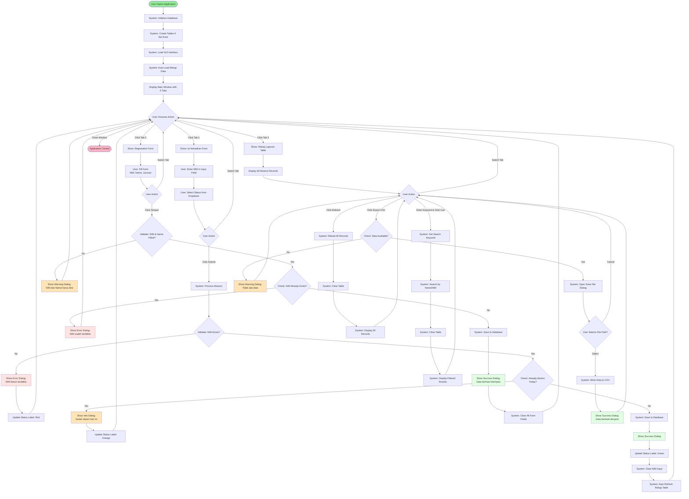
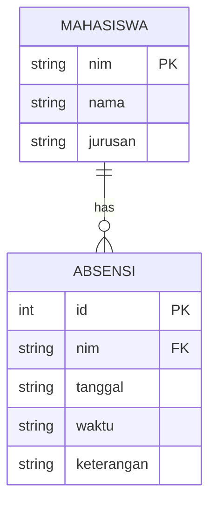
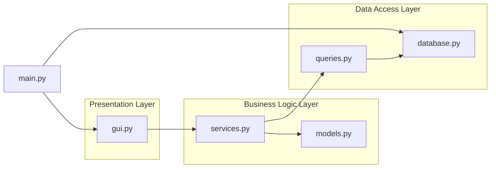
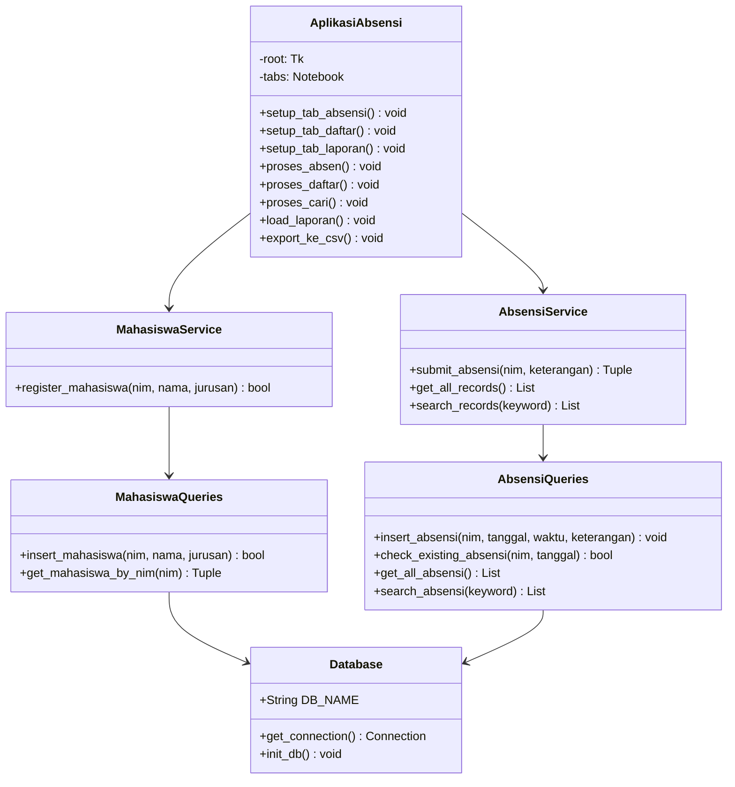
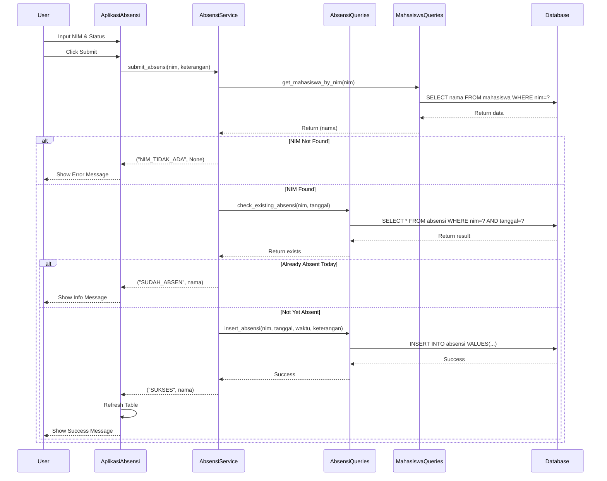
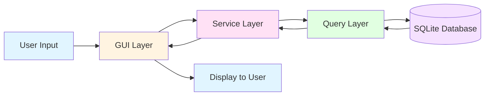

# Flowchart Aplikasi Absensi - Kelompok 3

## User Flow Diagram

## Database Schema Diagram

## Module Architecture Diagram

## Class Structure Diagram

## Sequence Diagram - Submit Absensi

## Data Flow Diagram

