# Flowchart Aplikasi Absensi - Kelompok 3

## User Flow - How to Absen (Attendance)

## Detail Flow: Aksi-Aksi User

### 1. Detail Flow - Cari/Filter Mahasiswa

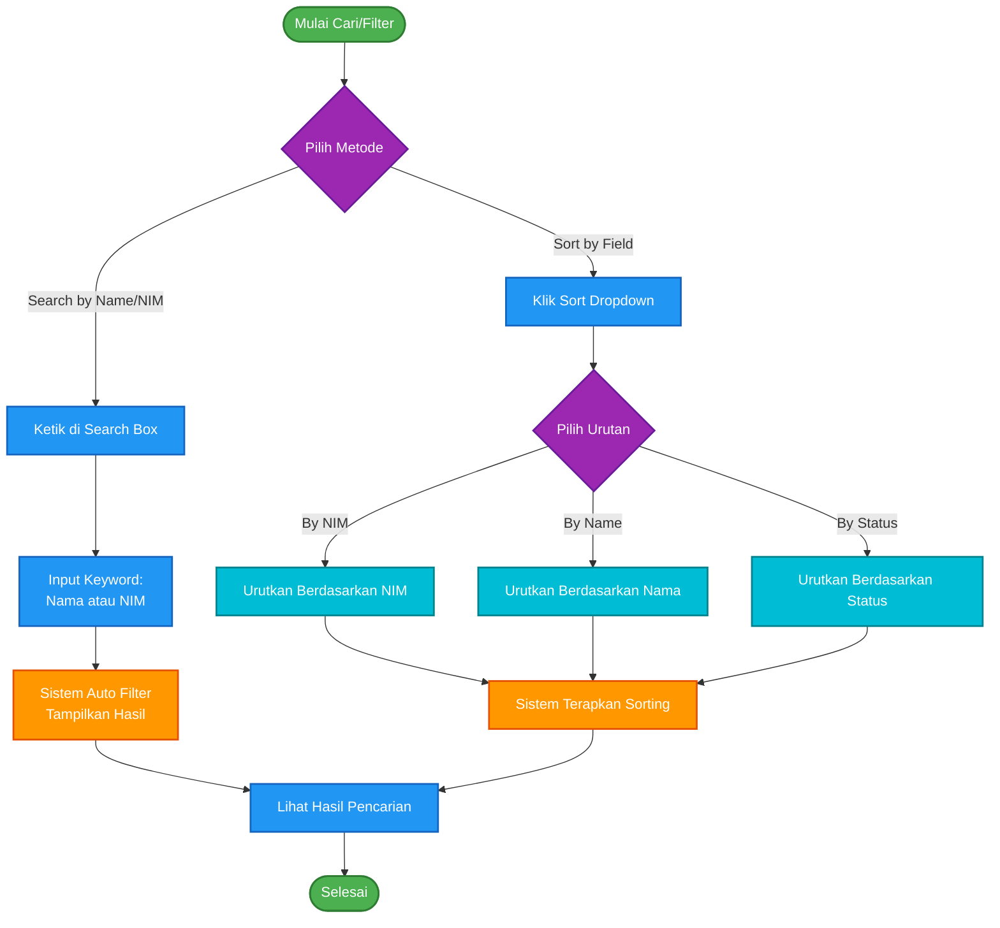

### 2. Detail Flow - Ubah Status Kehadiran

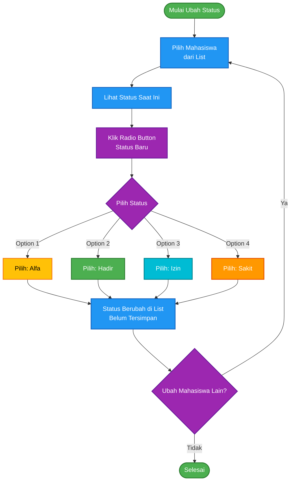

### 3. Detail Flow - Submit/Save Kehadiran

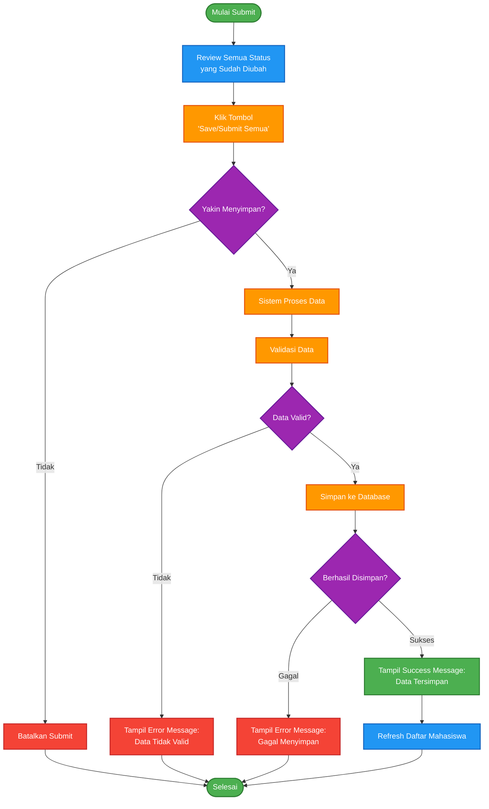

### 4. Detail Flow - Kelola Mahasiswa

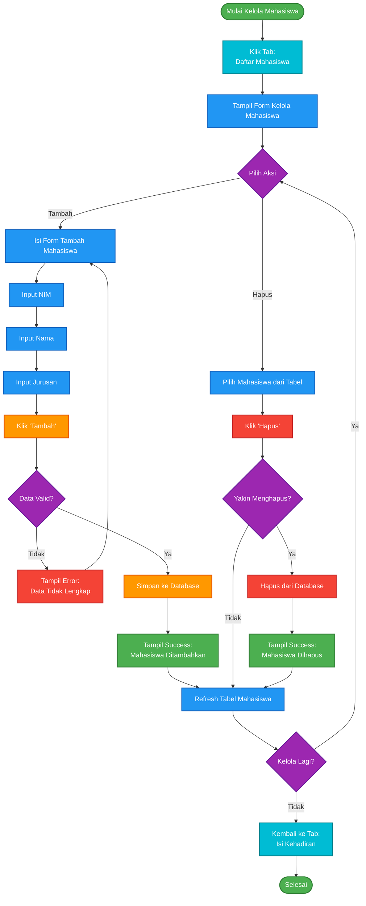

### 5. Detail Flow - Lihat Laporan

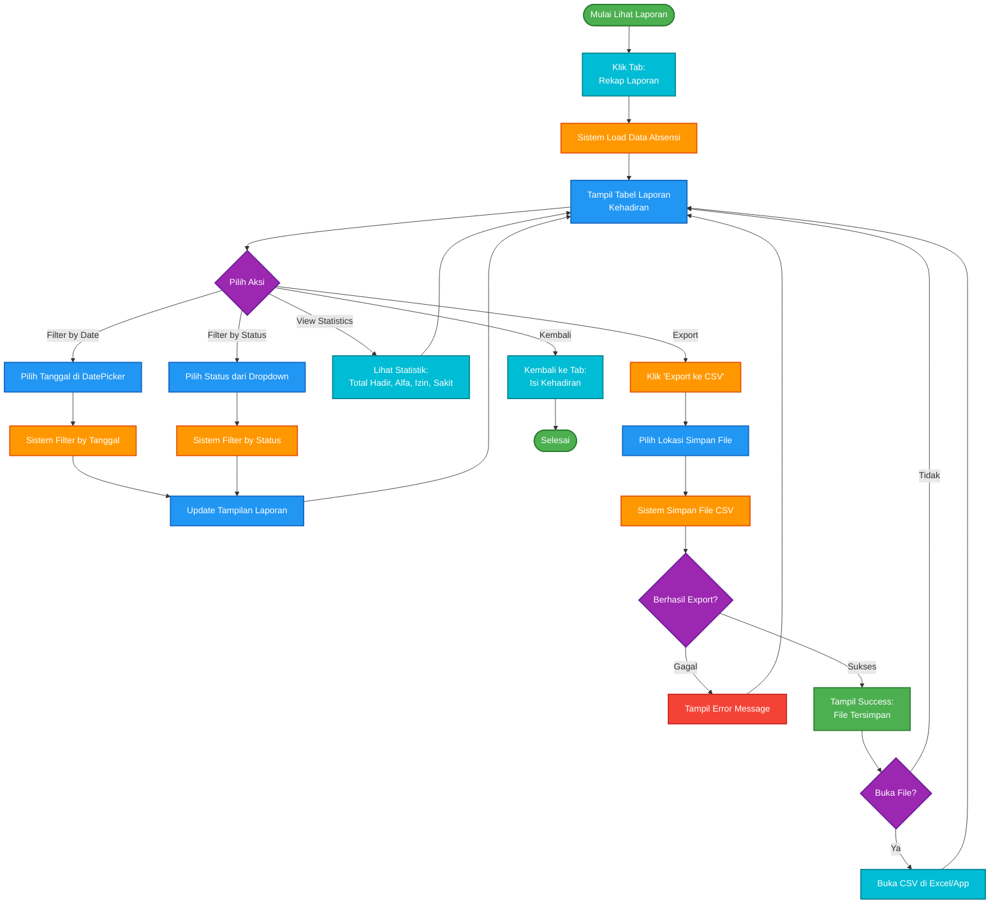

### 6. Detail Flow - Keluar Aplikasi

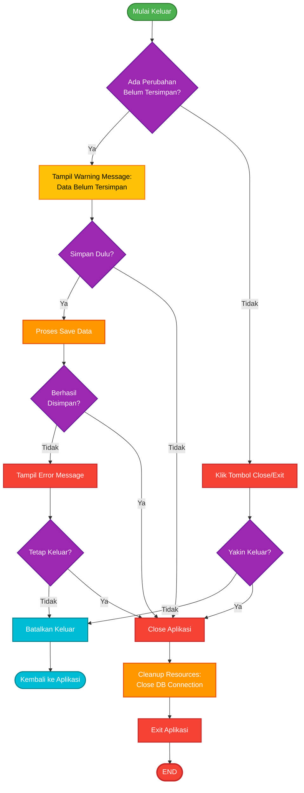

## Database Schema Diagram

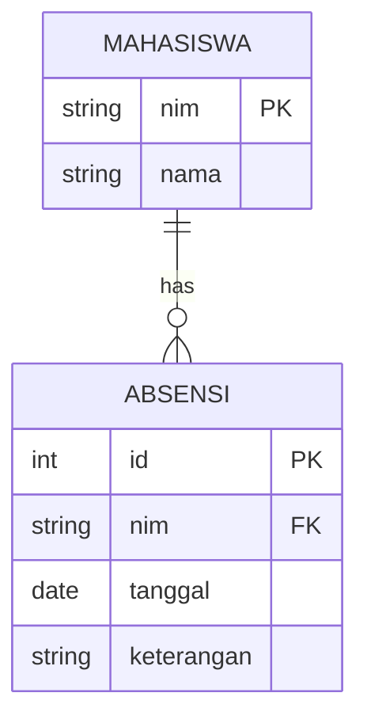

## Module Architecture Diagram

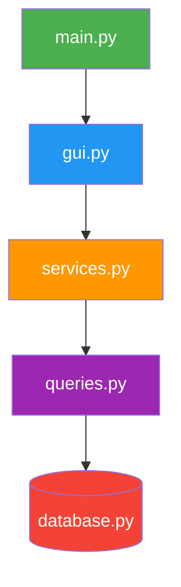

## Class Structure Diagram

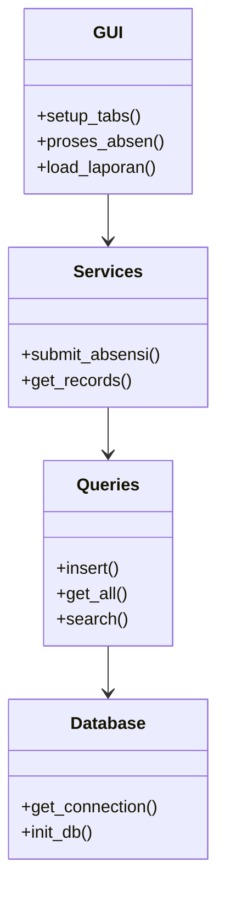

## Sequence Diagram - Submit Absensi

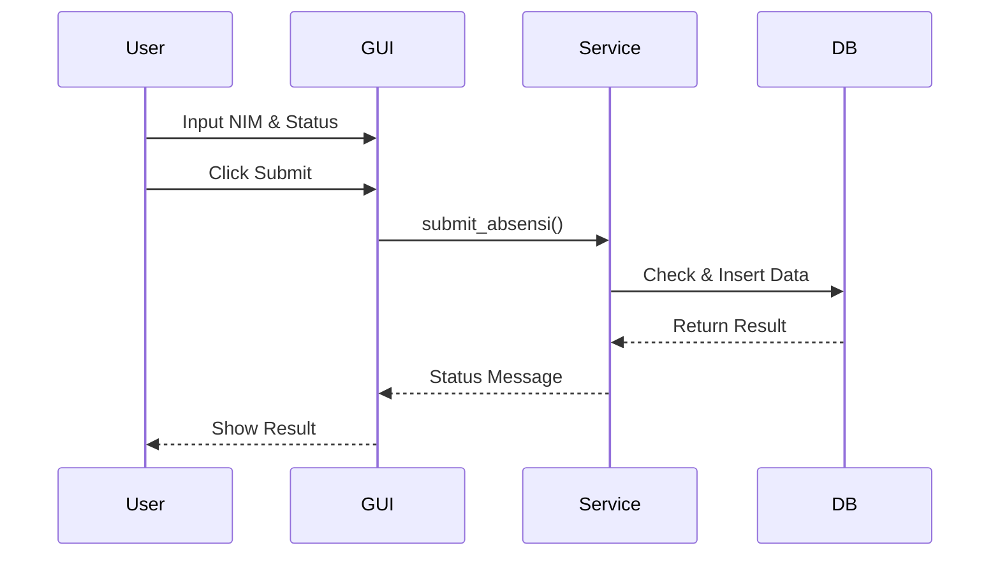

## Data Flow Diagram

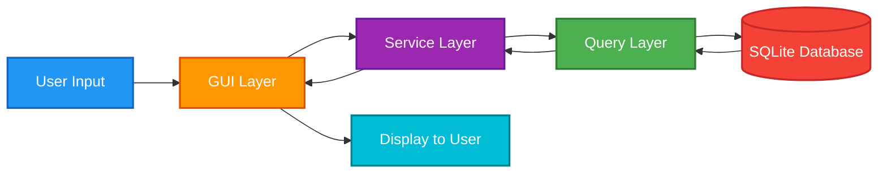
